<div align="center">
  
</div>

# Nylas PHP SDK

PHP bindings for the Nylas REST API (V2.0). https://docs.nylas.com/reference</br>

**What's new?**</br>

1. API 2.0 support</br>
2. All Nylas APIs have been implemented within this SDK.</br>
3. Chained calls and good code hints, easy to use</br>
4. Support send & get message in raw type</br>
5. Support async multiple upload & download</br>
   -- Contact picture download</br>
   -- File upload & download<br>
6. The parameters that required by methods almost the same as nylas official api required.</br>

```php
(new \Nylas\Client($options))->
```
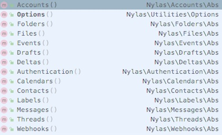</br>

## Installation

This library is available on https://packagist.org/packages/lanlin/nylas-php</br>
You can install it by running

```shell
composer require lanlin/nylas-php
```


## Usage

### App ID and Secret

Before you can interact with the Nylas REST API,</br>
you need to create a Nylas developer account at [https://www.nylas.com/](https://www.nylas.com/).</br>
After you've created a developer account, you can create a new application to generate an App ID / Secret pair.</br>

Generally, you should store your App ID and Secret into environment variables to avoid adding them to source control.</br>
The test projects use configuration files instead, to make it easier to get started.</br>

### Init Nylas-PHP

```php
use Nylas/Client;

$options =
[
    'debug'         => true,
    'log_file'      => dirname(__FILE__) . '/test.log',
    'account_id'    => 'your account id',
    'access_token'  => 'your access token',
    'client_id'     => 'your client id',        // required
    'client_secret' => 'your client secret'     // required
];

$nylas = new Client($options);
```


### Authentication

There are two ways you can authenticate users to your application.</br>
Hosted & Native are both supported.</br>

Here's the server-side(three-legged) OAuth example:</br>

1. You redirect the user to nylas login page, along with your App Id and Secret</br>
2. Your user logs in</br>
3. She is redirected to a callback URL of your own, along with an access code</br>
4. You use this access code to get an authorization token to the API</br>

For more information about authenticating with Nylas,</br>
visit the [Developer Documentation](https://docs.nylas.com/reference#authentication).</br>

In practice, the Nylas REST API client simplifies this down to two steps.</br>

**Step 1: Redirect the user to Nylas:**

```php
$params =
[
    'state'        => 'testing',
    'login_hint'   => 'test@gmail.com',
    'redirect_uri' => 'https://www.test.com/redirect_callback',
];

// generate the url that your user need be redirect to.
$url = $nylas->Authentication()->Hosted()->getOAuthAuthorizeUrl($params);
```

**Step 2: your user logs in:**</br>
**Step 3: you got the access code from the nylas callback:**</br>
Please implement the above 2 & 3 steps yourself.</br>

**Step 4: Get authorization token with access code:**

```php
$data = $nylas->Authentication()->Hosted()->postOAuthToken($params);

// save your token some where
// or update the client option
$nylas->Options()->setAccessToken("pass the token you got");
```

## Supported Methods

The parameters that required by methods almost the same as nylas official api required.

For more detail, you can view the tests or the source code of validation rules for that method.

### Accounts

$nylas->Accounts()->Account()-></br>
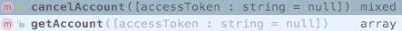</br>

$nylas->Accounts()->Manage()-></br>
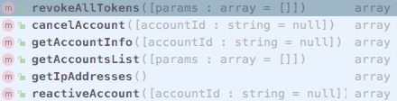</br>


### Authentication

$nylas->Authentication()->Hosted()-></br>
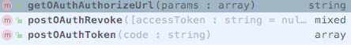</br>

$nylas->Authentication()->Native()-></br>
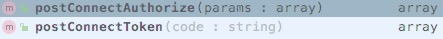</br>


### Calendars

$nylas->Calendars()->Calendar()-></br>
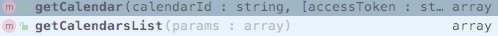</br>


### Contacts

$nylas->Contacts()->Contact()-></br>
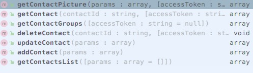</br>

```php
// multiple contact pictures download
$params =
[
    [
        'id'   => 'contact id',
        'path' => 'this can be a file path, resource or stream handle',
    ],
    [
        'id'   => 'xxxx',
        'path' => dirname(__FILE__) . '/correct.png',
    ],
    // ...
];

$nylas->Contacts()->Contact()->getContactPicture($params);
```


### Deltas

$nylas->Deltas()->Delta()-></br>
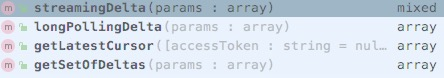</br>


### Draft

$nylas->Drafts()->Draft()-></br>
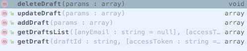</br>

$nylas->Drafts()->Sending()-></br>
</br>


### Events

$nylas->Events()->Event()-></br>
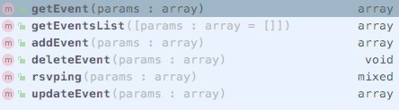</br>


### Files

$nylas->Files()->File()-></br>
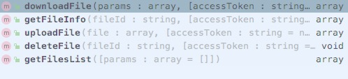</br>


```php
// multiple files download
$params =
[
    [
        'id'   => 'file id',
        'path' => 'this can be a file path, resource or stream handle',
    ],
    [
        'id'   => 'xxxx',
        'path' => dirname(__FILE__) . '/correct.png',
    ],
    // ...
];

$nylas->Files()->File()->downloadFile($params);


// multiple files upload
$params =
[
    [
        'contents' => 'this can be a file path, resource or stream handle',
        'filename' => 'your file name'
    ],
    [
        'contents' => dirname(__FILE__) . '/correct.png',
        'filename' => 'test_correct.png'
    ],
    // ...
];

$nylas->Files()->File()->uploadFile($params);
```


### Folders

$nylas->Folders()->Folder()-></br>
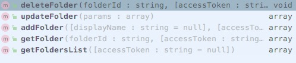</br>


### Labels

$nylas->Labels()->Label()-></br>
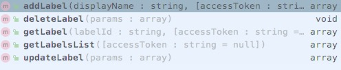</br>


### Messages

$nylas->Messages()->Message()-></br>
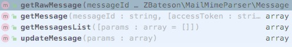</br>

$nylas->Messages()->Search()-></br>
</br>

$nylas->Messages()->Sending()-></br>
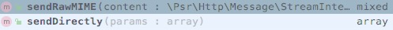</br>


### Threads

$nylas->Threads()->Search()-></br>
</br>

$nylas->Threads()->Thread()-></br>
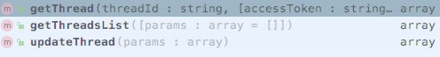</br>


### Webhooks

$nylas->Webhooks()->Webhook()-></br>
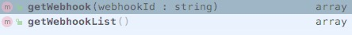</br>


## Contributing

For more usage demos, please view the tests.</br>
Please feel free to use it and send me a pull request if you fix anything or add a feature, though.</br>


## License

This project is licensed under the MIT license.
