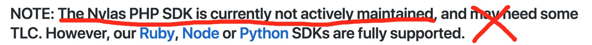

# Nylas PHP SDK

# 

PHP bindings for the Nylas REST API (V2.0). https://docs.nylas.com/reference</br>

Here's reason why not use the official version</br>


**1. All Nylas APIs have been implemented within this SDK.**</br>
**2. Chained calls and good code hints**</br>

Automatic incomplete effect under phpstorm:</br>
`$nylas->Accounts()->Account()->`</br>
</br>

`$nylas->Accounts()->Manage()->`</br>
</br>

## Installation

This library is available on http://packagist.org.</br>
You can install it by running

```shell
composer require lanlin/nylas-php
```


## Usage

### App ID and Secret

Before you can interact with the Nylas REST API,</br>
you need to create a Nylas developer account at [https://www.nylas.com/](https://www.nylas.com/).</br>
After you've created a developer account, you can create a new application to generate an App ID / Secret pair.</br>

Generally, you should store your App ID and Secret into environment variables to avoid adding them to source control.</br>
The test projects use configuration files instead, to make it easier to get started.</br>

### Init Nylas-PHP

```php
use Nylas/Client;

$options =
[
    'debug'         => true,
    'log_file'      => dirname(__FILE__) . '/test.log',
    'account_id'    => 'your account id',
    'access_token'  => 'your access token',
    'client_id'     => 'your client id',        // required
    'client_secret' => 'your client secret'     // required
];

$nylas = new Client($options);
```


### Authentication

There are two ways you can authenticate users to your application.</br>
Hosted & Native are both supported.</br>

Here's the server-side(three-legged) OAuth example:</br>

1. You redirect the user to nylas login page, along with your App Id and Secret</br>
2. Your user logs in</br>
3. She is redirected to a callback URL of your own, along with an access code</br>
4. You use this access code to get an authorization token to the API</br>

For more information about authenticating with Nylas,</br>
visit the [Developer Documentation](https://docs.nylas.com/reference#authentication).</br>

In practice, the Nylas REST API client simplifies this down to two steps.</br>

**Step 1: Redirect the user to Nylas:**

```php
$params =
[
    'state'        => 'testing',
    'login_hint'   => 'test@gmail.com',
    'redirect_uri' => 'https://www.test.com/redirect_callback',
];

// generate the url that your user need be redirect to.
$url = $nylas->Authentication()->Hosted()->getOAuthAuthorizeUrl($params);
```

**Step 2: your user logs in:**</br>
**Step 3: you got the access code from the nylas callback:**</br>
Please implement the above 2 & 3 steps yourself.</br>

**Step 4: Get authorization token with access code:**

```php
$data = $nylas->Authentication()->Hosted()->postOAuthToken($params);

// save your token some where
// or update the client option
$nylas->Options()->setAccessToken("pass the token you got");
```


### Accounts

Accounts Methods:</br>
`$nylas->Accounts()->Account()->`</br>
</br>

Manage Methods:</br>
`$nylas->Accounts()->Manage()->`</br>
</br>


### Calendars
**... @todo ...**


## Contributing

For more usage demos, please view the tests.</br>
Please feel free to use it and send me a pull request if you fix anything or add a feature, though.</br>


## License

This project is licensed under the MIT license.
